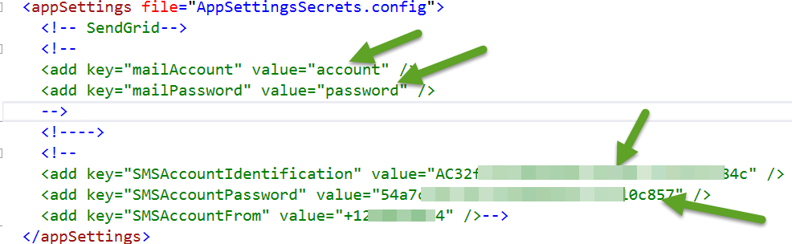
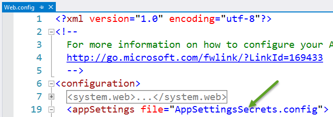

#Secure Secrets

This guide demonstrates how to deploy secrets to Azure. In this demonstration you will show how to 

* how to secure sensitive data
* deploy secrets to Azure

##Pre-requisites

This demonstration requires the following:

* Azure Subscription
* Visual Studio Version 2012/2013/2015
* Azure .Net SDK 1.5 and above
 
##Setup

_Estimated Time: 2 minutes_

1. Open Windows Explorer and navigate to the **SecureSecrets** folder.
    
2. Open the **Demo-SecureSecrets.sln** file in visual studio.

    

##Demo Steps
_Estimated Time: 5 minutes_

1. Open the Web.config file. The Web.config file is source code, so explain why secrets should never be stored in that file.

    

2. Fortunately, the <appSettings> element has a file attribute that allows you to specify an external file that contains sensitive app config settings. You can move all your secrets to an external file as long as the external file is not checked into your source tree.

    

3. For example, in this markup, the file **AppSettingsSecrets.config** contains all the app secrets.

    

4. A best practice is to follow a DevOps workflow and use Azure PowerShell to automate setting these values in Azure.

##Cleanup
_Estimated Time: 2 minutes_

1. None
