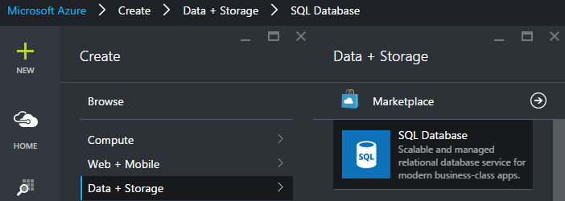
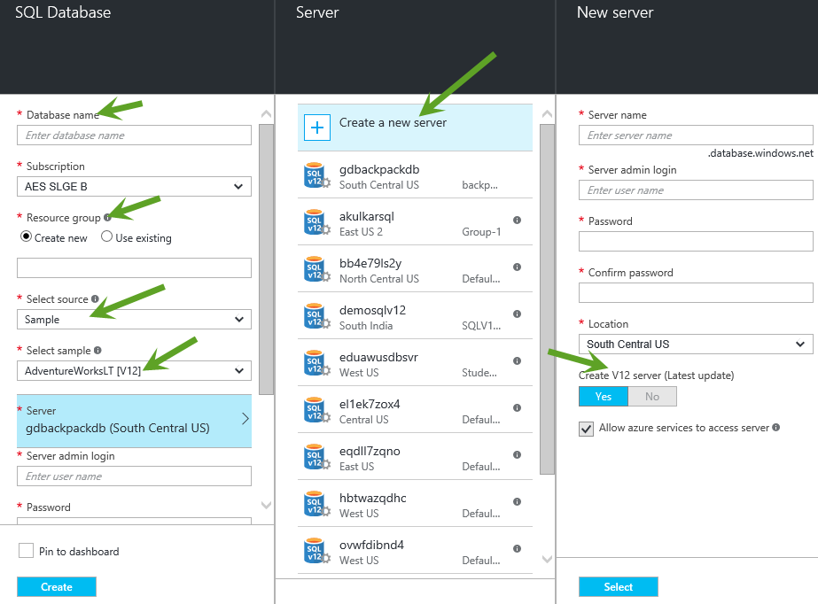
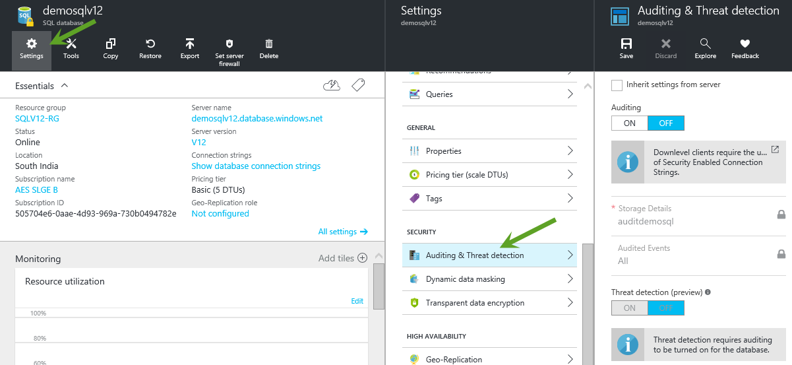
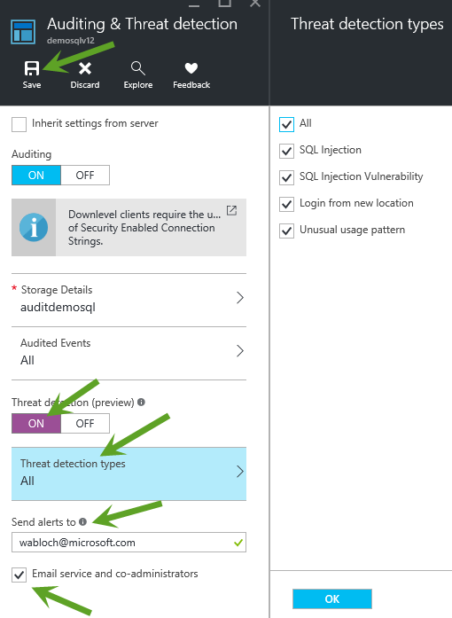
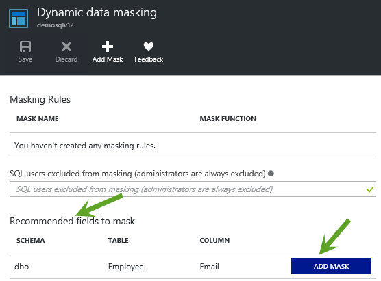
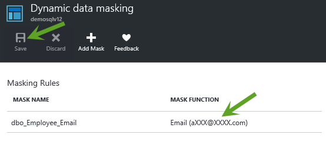
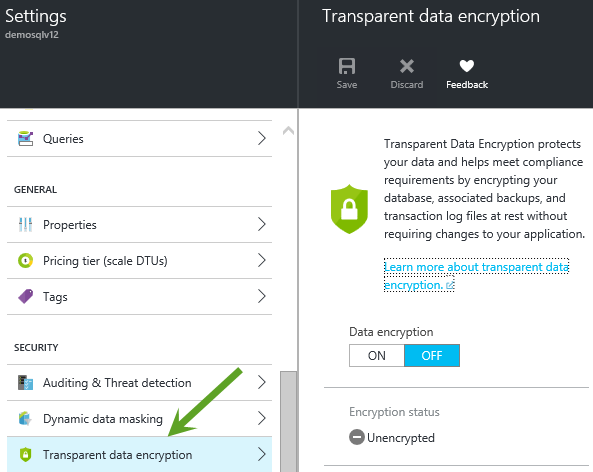
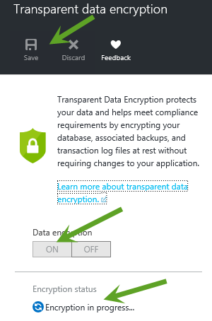

#SQLV12 security features

This guide demonstrates security features provided Azure SQL V12. In this demonstration you will show how to 

* how to enable Auditing & Threat detection for your SQL database
* how to mask sensitive data using Dynamic data masking
* how to secure sensitive data at rest using Transparent data encryption

##Pre-requisites

This demonstration requires the following:

* Azure Subscription
 
##Setup

_Estimated Time: 5 minutes_

####Step1: Create SQL V12 database####

1. Visit the Azure Portal at https://portal.azure.com and sign-in with your Azure Administrator or Contributor account.
    
2. On the left blade, click to New, click Data + Storage, click SQL Database.

    
    
3. Provide database name, select Server, Create a new server and provide server details like server name, server admin login, password, confirm password, location. Select “Yes” when asked Create V12 server. Click OK.

    
    
4. Once created, click on newly created SQL Database.

####Step2: Permissions####
    
1. To sign up for the preview and to configure TDE through the Azure portal, you must be connected as the Azure Owner, Contributor, or SQL Security Manager.

2. To configure TDE by using Transact-SQL requires the following:

    a. To create the database encryption key, you must be a SQL Database administrator or you must be a member of the dbmanager role in the master database and have the CONTROL permission on the database.

    b. To execute the ALTER DATABASE statement with the SET option only requires membership in the dbmanager role.
    
##Demo Steps
_Estimated Time: 10 minutes_

####1: Auditing & Threat detection####

1. Visit the Azure Portal at https://portal.azure.com and sign-in with your Azure Administrator or Contributor account.

2. On the left banner, click to BROWSE, and then click SQL databases. With SQL databases selected in the left pane, click your user database.

3. In the database blade, click All settings. In the Settings blade, click Auditing & Threat detection part to open the Auditing & Threat detection blade.

    

4. To enable auditing, in the Auditing & Threat detection blade, switch on Auditing button, provide storage details, select audited events, and then click Save (at the top of the page) to apply the setting.

    

5. To enable threat detection (preview), in the Auditing & Threat detection blade, switch on Threat detection (preview) button, select threat detection types, provide email address in send alerts to textbox, check email service and co-administrator, and then click Save (at the top of the page) to apply the setting.

    

####2: Dynamic data masking####

1. Visit the Azure Portal at https://portal.azure.com and sign-in with your Azure Administrator or Contributor account.

2. On the left banner, click to BROWSE, and then click SQL databases. With SQL databases selected in the left pane, click your user database.

3. In the database blade, click All settings. In the Settings blade, click Dynamic data masking part to open the Dynamic data masking blade.

    

4. To enable Dynamic data masking, Microsoft Azure platform provide recommondation fields to mask. Click button ADD MASK to enable masking for the recommended fields, and then click Save (at the top of the page) to apply the mask.

    

    

####3: Transparent data encryption####

1. Visit the Azure Portal at https://portal.azure.com and sign-in with your Azure Administrator or Contributor account.

2. On the left banner, click to BROWSE, and then click SQL databases. With SQL databases selected in the left pane, click your user database.

3. In the database blade, click All settings. In the Settings blade, click Transparent data encryption part to open the Transparent data encryption blade.

    

4. In the Transparent data encryption blade, move the Data encryption button to ON, and then click Save (at the top of the page) to apply the setting. The Encryption status will approximate the progress of the transparent data decryption.

    

##Cleanup
_Estimated Time: 5 minutes_

1. Open Windows Explorer and navigate to the **Secure-Solutions/Demo-SQLSecurity** folder.

2. Right-click on **Cleanup-Demo.ps1** and select **Run with PowerShell**.  _Note: You can run the script from the PowerShell ISE if you prefer. Either way will work the same._

    The script requires one parameter which is your Azure Subscription ID.  _Note: If you changed the resource group name when you ran the Deploy-Demo script during setup, then make sure you supply the new resource group name you used.  Otherwise, the default resource group name is assumed._  

    
