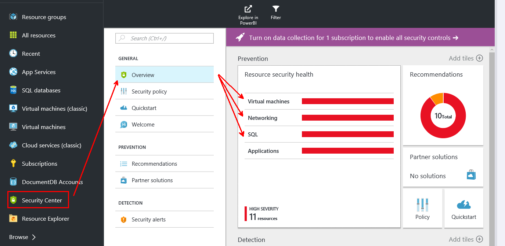
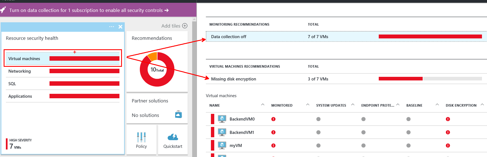
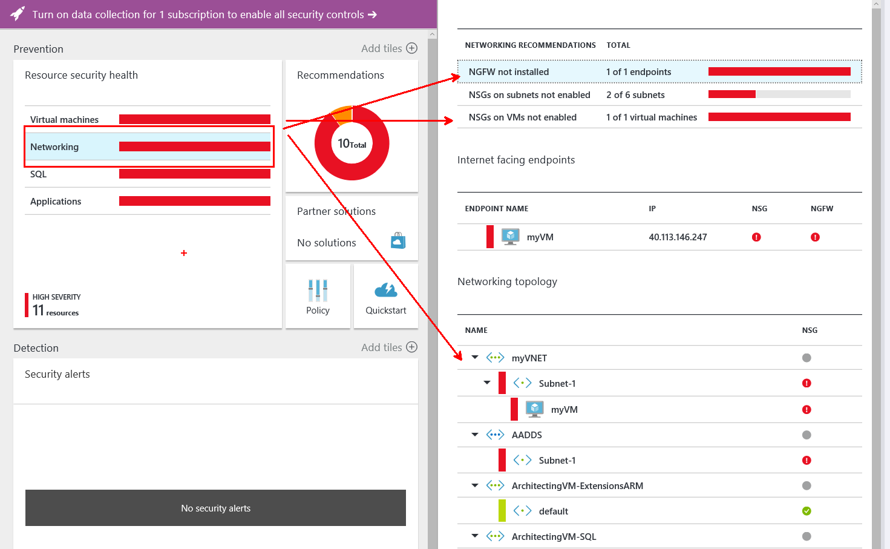
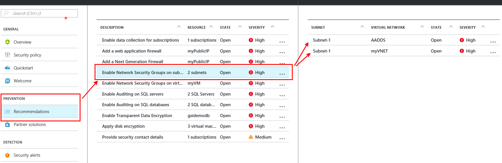
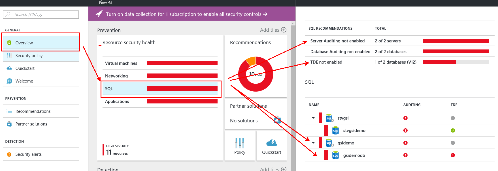

#Demo - Security Center and SQL Database V12 security features

This guide demonstrates security features provided in Azure SQL Database V12, complemented and guided along by Azure Security Center's recommendations. In this demonstration you will show how to 

* use Azure Security Center as entry point for security analysis 
* enable Auditing & Threat detection for your SQL database
* mask sensitive data using Dynamic data masking
* secure sensitive data at rest using Transparent data encryption

##Pre-requisites

This demonstration requires the following:

* Azure Subscription
 
##Setup

_Estimated Time: 5 minutes_

This should be done in good time before presentation, such that Security Center can pickup any changes (recommend 24 hours)

1. Visit the Azure Portal at https://portal.azure.com and sign-in with your Azure Administrator or Contributor account.
    
2. On the left blade, click to New, click Data + Storage, click SQL Database.

    
    
3. Provide database name, select Server, Create a new server and provide server details like server name, server admin login, password, confirm password, location. Select “Yes” when asked Create V12 server. Click OK.

    
    

##Demo Steps
_Estimated Time: 10 minutes_
####1: Azure Security Center####
1. Open the Azure Portal at https://portal.azure.com and sign-in with your Azure Administrator or Contributor account.
2. On the left banner, find the Security Center (or click to BROWSE, and then click Security Center)

    

3. With the Overview Blade opened, browse some of the existing findings, such as shown below. By drilling down into each category (Virtual Machines, Networking etc), there is a list of findings and recommendations how to fix.

    

    

3. Navigate to the Recommenations tab in Prevention category. This view provides a consolidated view of findings and recommendations grouped by resources. 

    

4. Go back to the Overview Blade, Select the SQL category, and show the recommendations for Auditing and TDE. In the next steps, will apply the recommendations and fix the security vulnerabilities.

    

####2: Auditing & Threat detection####

1. On the left banner, click to BROWSE, and then click SQL databases. With SQL databases selected in the left pane, click your user database.
2. In the database blade, click All settings. In the Settings blade, click Auditing & Threat detection part to open the Auditing & Threat detection blade.

    

3. To enable auditing, in the Auditing & Threat detection blade, switch on Auditing button, provide storage details, select audited events, and then click Save (at the top of the page) to apply the setting.

    

4. To enable threat detection (preview), in the Auditing & Threat detection blade, switch on Threat detection (preview) button, select threat detection types, provide email address in send alerts to textbox, check email service and co-administrator, and then click Save (at the top of the page) to apply the setting.

    

####3: Dynamic data masking####

1. On the left banner, click to BROWSE, and then click SQL databases. With SQL databases selected in the left pane, click your user database.
2. In the database blade, click All settings. In the Settings blade, click Dynamic data masking part to open the Dynamic data masking blade.

    

3. To enable Dynamic data masking, Microsoft Azure platform provide recommondation fields to mask. Click button ADD MASK to enable masking for the recommended fields, and then click Save (at the top of the page) to apply the mask.

    

    

####4: Transparent data encryption####

1. On the left banner, click to BROWSE, and then click SQL databases. With SQL databases selected in the left pane, click your user database.

2. In the database blade, click All settings. In the Settings blade, click Transparent data encryption part to open the Transparent data encryption blade.

    

3. In the Transparent data encryption blade, move the Data encryption button to ON, and then click Save (at the top of the page) to apply the setting. The Encryption status will approximate the progress of the transparent data decryption.

    

##Cleanup
_Estimated Time: 5 minutes_

* Remove the ResourceGroup created in Preparation Step 3, and the SQL Server instance. Alternatively, reset the configuration changes for Auditing, Data Masking, and TDE.
