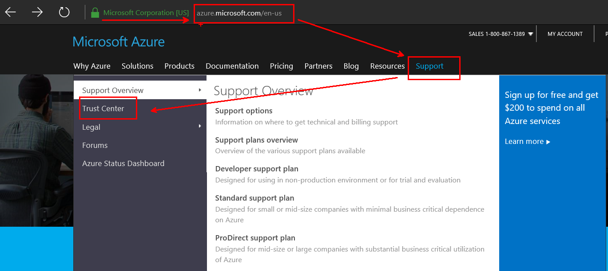
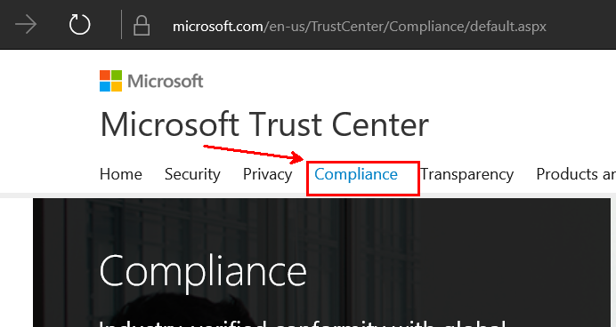
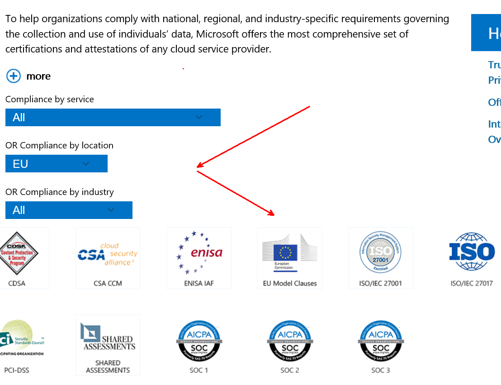
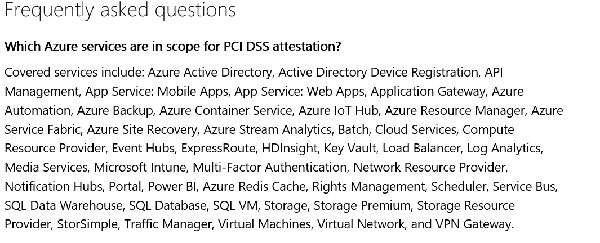
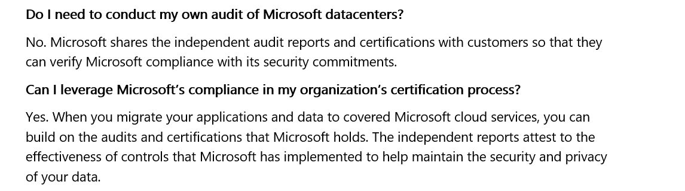

#Demo - Microsoft Azure Trust Center

When you entrust your data to the Microsoft Cloud, you will have questions. Where is it and who can access it? What is Microsoft doing to protect it and comply with regulatory requirements? How can you verify that Microsoft is doing what it says?

The Microsoft Trust Center has the answers. Because it’s your data, you decide who has access, and you work with us to decide where it is located. To safeguard your data, we use advanced security technology and cryptography. Our compliance is independently audited, and we’re transparent on many levels—from how we handle legal demands for your customer data to the security of our code. We offer detailed trust information on each of our cloud services.

##Pre-requisites

This demonstration does not have any particular requirements beyond a working internet connection and a web browser.

##Setup

No setup required.

##Demo Steps
_Estimated Time: 5 minutes_

####Azure Trust Center####
1. Open the Azure Website at https://azure.com and navigate to the Azure Trust Center, which is found under Support --> Trust Center

 

2. Explain the Azure Trust Center, which is the starting point and reference documentation for all questions and concerns regarding security, privacy, transparency and compliance.

3. Beside Azure, Microsoft offers detailed trust information for all its cloud services, such as Office 365 or Microsoft Dynamics. All information is now bundled in the [Microsoft Trust Center](https://www.microsoft.com/en-us/TrustCenter/default.aspx). Navigate there by using any of the "Learn more about ..." links in the Azure Trust Center overview.

4.  To understand compliancy efforts with national, regional, and industry-specific requirements governing the collection and use of individuals’ data, the [Compliance](https://www.microsoft.com/en-us/TrustCenter/Compliance/default.aspx) section would be the reference. Navigate there if you haven't already. Microsoft offers the most comprehensive set of certifications and attestations of any cloud service provider.

 

5. Use the filter to limited results and focus on certifications most relevant to the audience, such as geographic focus (ie. EU or Australia) or industry focus (ie. Financial Services).

 

6. You may select and dive into any of the compliance certifiations to get more details. Beside general information of the particular certification and attestation, there you will find information about the scope of the certification and which Azure services are included.

 

7. Not all Azure Services may be part of a certification at a given point in time. This doesn't mean the services are not compliant on purposes. Certifications are typically run and renewed on an annual cycle. If Azure Services where not generally available (e.g. still in preview) the last time of an certification audit, they should be included at the next cycle.   

8. While audit reports covers the Microsoft Azure platform and services, they do not automatically extend to the customer's applications. This is in the customers responsibility, but certainly builds on top of Microsoft certification. Each certification section has further information how to leverage Microsoft's certifications, whether this could be obtained through Microsoft or the certification organization.

 

##Cleanup
No cleanup required.
